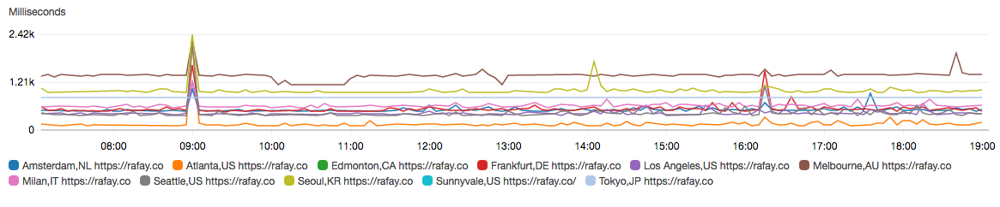
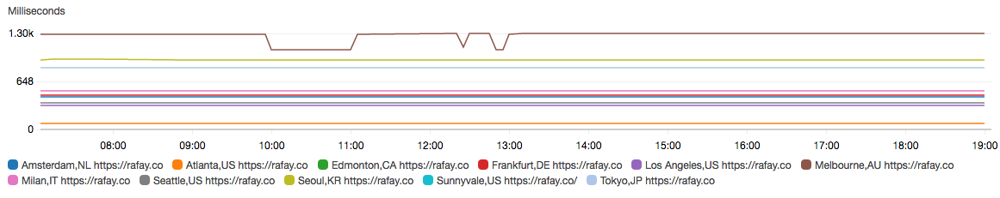

# Rafay Performance Monitoring Application #

This repo lets you build and run a performance measurement and monitoring application.  The first
version, v1, demonstrates basic functionality in a minimal container image; v2 builds out more
functionality, including the ability to publish statistics to CloudWatch.  This version includes
instructions how to publish an application to the Rafay platform, which lets you run it from one or
many locations.

The app has three flavors:

1.  Standalone -- a golang app you can run on your laptop.
2.  Docker -- a container that you can run as a component in many locations.
3.  Rafay Workload -- the Docker container running in one or more Edge locations on the Rafay
    platform.  (Coming in the full version of the app.)

If you want to view the simpler version without so many features, look at branch v1 in github, or
consider `git checkout v1` if you clone it.


## Description

This application makes an HTTP or HTTPS request to one or more target URLs and collects overall
response time data as well as detailed response time statistics.

### Prerequisites

Perftest is written in [golang](https://golang.org/doc/install).
Install and configure it using instructions at the link above.

If you don't want to install `go`, you can run a pre-built version of
`perftest` from DockerHub (see "Run from Docker" below).

If you want to build and run perftest in a container you will need the
[Docker environment](https://docs.docker.com/get-started/).  If you have
golang you can still build and run a standalone version.

## How to Build and Run

Clone this repo.
  * Use "gmake standalone" to build the local standalone app.
  * Use "gmake docker" if you want to build the docker image.
  

Once you've built the app you can run it in one of two ways, standalone or as a docker.

**Standalone**: To run a test from the command line: `cmd/perftest/perftest -n 5 https://www.google.com`.  You
will see output like this:

    # timestamp	DNS	TCP	TLS	First	LastB	Total	HTTP	Size	From_Location	Remote_Addr	proto://uri
    1 1554917703	24.168	14.607	127.732	61.524	1.333	209.282	200	12051	192.168.2.35	172.217.0.36	https://www.google.com
    2 1554917713	1.374	14.204	49.462	59.318	1.995	125.206	200	12017	192.168.2.35	172.217.0.36	https://www.google.com
    3 1554917723	1.265	14.341	52.774	63.336	3.908	134.661	200	12052	192.168.2.35	172.217.0.36	https://www.google.com
    4 1554917733	2.007	17.288	56.195	65.746	1.727	141.187	200	12000	192.168.2.35	172.217.0.36	https://www.google.com
    5 1554917744	19.876	12.394	56.910	73.899	2.003	145.440	200	12040	192.168.2.35	172.217.164.100	https://www.google.com
    
    Recorded 5 samples in 41s, average values:
    # timestamp	DNS	TCP	TLS	First	LastB	Total	HTTP	Size	From_Location	Remote_Addr	proto://uri
    5 41s   	9.738	14.567	68.615	64.764	2.193	151.155		12032		https://www.google.com
    
Each line has a request count (1..5), the epoch timestamp when the test started, and the time in
milliseconds measured for the following actions:
  * DNS: how long to look up the IP address(es) for the hostname
  * TCP: how long the TCP three-way handshake took to set up the connection
  * TLS: how long the SSL/TLS handshake took to establish a secure channel
  * First: how long until the first byte of the reply arrived (HTTP response headers)
  * LastB: how long until the last byte of the reply arrived (HTTP content body)
  * Total: response time of the application, from start of TCP connection until last byte
  * HTTP: response code returned from the server; 500 indicates a failure to connect
  * Size: response size in content bytes received from the upstream (response body, not headers)
  * From_Location: where you said the test was running from (REP_LOCATION environment variable)
  * Remote_Addr: the IP address hit by the test (may change over time, based upon DNS result)
  * proto://uri: the request URL (protocol and URI requested)

The final section provides the count of samples, the total time, and averages for the above values.
If you test to multiple endpoints you'll see multiple sections as each completes.

> Interestingly, in the example above we see the remote address changed in the last sample, following a
> DNS resolution.  Each test makes a DNS query; most of them return quickly from cache, but the last
> one fetched a fresh answer -- and it changed.

**Docker**: To run the containerized app you can say "gmake run" from the command line, which will
build the docker image (if needed) and run it out of the local docker repo with default arguments.
You can modify the arguments in the Makefile, or use a variant of its `docker run` invocation
directly from the shell.  You'll see similar output as above.

A recent version of `perftest` is available in the DockerHub and Rafay registries as noted below.
You can fetch it from public DockerHub to your local system via `docker pull rafaysystems/perftest`
if you prefer not to build from source.  Or you can just run it using a command line like the one
in the Makefile:

    docker run --rm -it -e PERFTEST_URL="https://www.google.com" -e REP_LOCATION="Your Town,US" rafaysystems/perftest:v5 -n=5 -d=2

This example also shows how the application picks up values from the environment.  This will be
useful as we build out the edge application.

If you want to push it to your DockerHub repo, you can `gmake push`.  This
requires the following environment variables:

``` shell
export DOCKER_USER="your docker username"
export DOCKER_EMAIL="the email address you registered with DockerHub"
```

You will need to login to DockerHub to establish credentials:

``` shell
docker login --username=${DOCKER_USER} --email=${DOCKER_EMAIL}
```

Supply your password if/when prompted.
Now you can `gmake push` to upload the docker to DockerHub.


## Run from Docker

If you don't want to build your own local copy, but you have docker
installed, you can just run a pre-built version from there using a command
line similar to this:

``` shell
docker run rafaysystems/perftest:v5 -n 5 -d 1 https://www.google.com/
```

# Run on Rafay

The above is available with the v1 functionality.  Let's look now at how to create
and manage a containerized application on the Rafay platform.  For more info
check out [our recent blog post](https://rafay.co/blog/rafay-open-source/)
and web site.  The Rafay platform lets you run a containerized app in one or
many locations easily.  Our locations run Kubernetes clusters but you don't
have to be a Kubernetes expert to run containers on them.  We handle the
cluster setup and management details.

First, you should build the docker container with `make docker`.  You don't
need to push it to DockerHub, you will publish it to the Rafay registry via
a CLI tool we provide.

## Creating a Rafay Workload

To run a workload on the Rafay Platform you will need to sign up for an
account (they are free) and then configure the workload to run on one or
more edges.

### Sign Up and Login

The [product documentation](https://console.rafay-edge.net/docs/) has more
information about how to sign up and use the platform. Here we provide a quick
start to get `pingmesh` up and running.

First, Go to the [Rafay Admin Console](https://console.rafay-edge.net/). To
create an account, click [Sign Up](https://console.rafay-edge.net/#/signup).
You'll get an email back from Rafay Operations when the account is approved.

Next, login to the [Rafay Admin Console](https://console.rafay-edge.net/) to get
started configuring your application.

To publish a workload you'll need to download the Rafay CLI (command line
interface) utility.  You only need to do this once, you can skip the next
step if you've got it already...

### Initialize rafay-cli tool

First you will need credentials in order to push workloads to the platform.
Go to Users in the left navigation bar on your username row click the dots
to the right and select Manage Keys.  Create New API Key and New Registry
Key and copy the values for use later.  (There is no way to retrieve the
Secret Key values.  If you lose a secret you must create a new one.)

Go back to Users and click Download CLI to get the  tool.  Extract the
rafay-cli binary from the tar file and remember its location.

``` shell
bunzip2 -c rafay-cli-darwin-amd64.tar.bz2 | tar xvf -
```

Now initialize the rafay-cli and provide the following values at the
prompts.

``` shell
rafay-cli init
```

Enter API key: 
    your API Key from the API key create dialog
Enter API secret: 
    your API Secret from the API key create dialog
Enter Rafay username: 
    your username from the Users page
Enter Rafay registry secret: 
    your secret from the registry key create dialog
Enter Rafay organization label: 
    your organization label from the registry key create dialog

You should see a message like

``` shell
Rafay CLI environment successfully initialized. Config file generated at (/Users/jad/.rafay/cli/config).
```

Now you're ready to use the CLI tool.

### Upload Container to Rafay

Build the container, if you haven't already, with `make docker`.
Then upload it to the Rafay Admin Console as follows.

``` shell
$ make rafay-push
docker tag perftest perftest:201907251331 # tag local image name with timestamp
rafay-cli image upload perftest:201907251331
Uploading Image 100 / 100 [==========================================================] 100.00% 5s

Login Succeeded
The push refers to repository [rcr.rafay-edge.net:6000/jade_systems/jadesystemslosaltos/perftest]
e1e8e05fa263: Preparing
57d960c31f45: Preparing
23f7bd114e4a: Preparing
23f7bd114e4a: Layer already exists
57d960c31f45: Pushed
e1e8e05fa263: Pushed
201907251331: digest: sha256:a0f8645b6f26b4f95a9203a3dc8e13cfcebafd2d6651737efa778f46ed921ff9 size: 949
Untagged: rcr.rafay-edge.net:6000/jade_systems/jadesystemslosaltos/perftest:201907251331
Untagged: rcr.rafay-edge.net:6000/jade_systems/jadesystemslosaltos/perftest@sha256:a0f8645b6f26b4f95a9203a3dc8e13cfcebafd2d6651737efa778f46ed921ff9

Successfully uploaded the image:

	rcr.rafay-edge.net:6000/jade_systems/jadesystemslosaltos/perftest:201907251331

Please use the above image name in your workloads.
```

Remember the image label above for the next step for the container
configuration dialog.


### Configure Workload

Once logged in to the Admin Console go to the Workloads page and click New
Workload.  Enter a name, and description, like this:

| Field | Value |
|-------|-------|
| Name | my-perftest |
| Description | Performance testing application |

I am creating this in my organization's default namespace, Jade-systems.
Your org name will populate in the Namespace box, you don't need to do
anything with this for now.

The next screen lets you configure your container.  Click on New Container.

The Container Name is `perftest`.
Choose the image name and tag name from above.
This image does not use any ports, you can leave the default port 80 there.

Select a size and initial replica count.  The micro size is fine for this
app, and there should only be one replica.

Now select the Startup Configuration section.  This is where we'll specify
what test we are going to run and where to send the output.

Click Add Startup Configuration and select Environment Variable.  Fill in
with values like this, clicking Add Startup Configuration as needed:

| Name | Value | Comments |
|------|-------|----------|
| PERFTEST_URL | https://www.google.com | URL for the app to test |
| AWS_REGION | your AWS preferred region | CloudWatch region |
| AWS_ACCESS_KEY_ID | your AWS access key id | CloudWatch credentials |
| AWS_SECRET_ACCESS_KEY | your AWS secret access key | CloudWatch credentials |

If you leave these marked Secure they will not appear in the UI and will be
transmitted securely to the Rafay platform.

Click "Save and Return to Container List".

You will see selections for log aggregation, shared volumes, and a key-value
store.  This application doesn't need any of that so let's move on ...

Click "Save and go to Policies".

### Publish the Workload

The next screen lets you choose how to upgrade the container when a new one
is published.  We support Recreate (the default) which kills the running
container and starts a new one.  This is fine for `perftest`, but for a
container with user interaction you may prefer a gentler upgrade policy.

Click "Save and go to Placement".

Now we choose where to run the application.  You'll see "Specific Locations"
in the dropdown and a list of cities to choose from.  We also support a
"Performance" policy if your container takes user requests: we can place it
near the user base for that workload, automatically adjusting placement as
the situation changes.  But for this workload we just choose one location
and try it from there.

Click "Save and go to Publish" for the final step.

Click "Publish".  You will see a pin bouncing at the location you
specified.  It will turn green in a minute or so if deployment succeeds.

When you're done, click "Unpublish" to stop the workload running.

Or you can change the runtime configuration settings (environment variables)
if you want to test a different target.  Or change Placement if you want to
test from a different location.  Then go back to the Publish page and click
"Republish".

If you change the application code or Dockerfile you should update VERSION
in the Makefile, rebuild the docker, and upload it again with `rafay-cli`
using the new version tag, instead of ":v2" as specified above.

You can find more detailed configuration instructions in our [Quick Start
guide](https://rafay.zendesk.com/hc/en-us/articles/360007054432-Quick-Start-Guide-Custom-Image-)
for this and other scenarios.  You'll need Rafay credentials to pull up
zendesk content at this time.

 
## Debugging Workload Issues

If the workload fails to place, try running it locally, for example
(assuming you are now at v3):

``` shell
docker run perftest:v3 -v -n 5 -d 1 https://www.google.com/
```

If it runs OK locally, click Debug and then "Show Container Events" to see
what happened we tried to load the container.  And look at the logs to see
if the application encountered an issue.  You can also get a shell to try
out the application locally.  (The shell does not work in firefox, so use
chrome or safari for this feature.)

## Looking at Memory Utilization

I was curious how much memory I was using in my workload, and if I had a
memory leak.  Debugging this in a docker is not so easy (especially a
minimal one), and doing so in multiple locations is even harder.   So I
added a simple web server function to my application to return memory usage
information using the golang `runtime.MemStats` feature.

Docker version v5 includes this new port flag.  Here's an example, using a
not-so-random port, testing against google every 30 seconds:

``` shell
docker run -p 52378:52378 perftest:v5 -d 30 -p 52378 https://www.google.com/
```

Now view memory stats by pointing your browser to `localhost:52378/memstats`. If
it's not there make sure you used both -p options above with the same port. (The
fist -p argument tells `docker run` to connect the container port to the outside
world. The second one tells `perftest` what port to listen on. They must agree.)

## Viewing Workload Results

There are a couple ways to see what is happening.

First, click "Debug".  You will see the stdout of the container, which looks
similar to what you saw running it locally.  You can save the stdout log
using the download link (arrow icon).

If you configured the AWS environment you can also view it in your AWS
CloudWatch instance.
  * Login to [your AWS console](console.aws.amazon.com) (the one that
    corresponds to AWS credentials you entered into the Rafay console).
  * Navigate to CloudWatch Metrics, select all metrics, and watch the data
    roll in.
    
You'll note that the Rafay workload picks up a location label automatically
from the environment: we put REP_LOCATION, and a few other items, into the
shell environment of every container.  You can see them by running a
go-httpbin testapp we also provide (at the /env/ endpoint).

With the tool running you can spot long term trends and interesting anomalies.
The following CloudWatch graph shows `perftest` running in 11 locations on the
Rafay sandbox network. The graph shows the p95 metric (95th percentile of the
response time metric) in 5 minute buckets across 12 hours.



The observations and questions I draw from this include:
  * What happened at 09:00? The response time degraded across *all locations*
    at that time. A CloudWatch alert can help notify when such things occur. And
    `perftest` can send alerts directly as well (see the usage message).
  * Looking at the general trend we can see the difference in response time by
    location. Australia is always over 1 second page response time, while
    Atlanta is almost always below 100 msec.
  
Looking at the p10 (10th percentile) metric shows the best 10 second sample
across each 5 minute period. See the image below. This adds some insights.
  * The 09:00 spike did not last all five minutes. It was transient. 
  * Reponse time is nearly flat in every geography. This informs us about the
    network latency that drives baseline performance. At the p10 we clearly see
    a period of time wehre Melbourne performance improves measurably.



Combined with alerts and log collection from the container you can dig into the
questions remaining in the basic metrics. I hope the tool helps if you are on
the path of a performance analyst as I have been many times.
